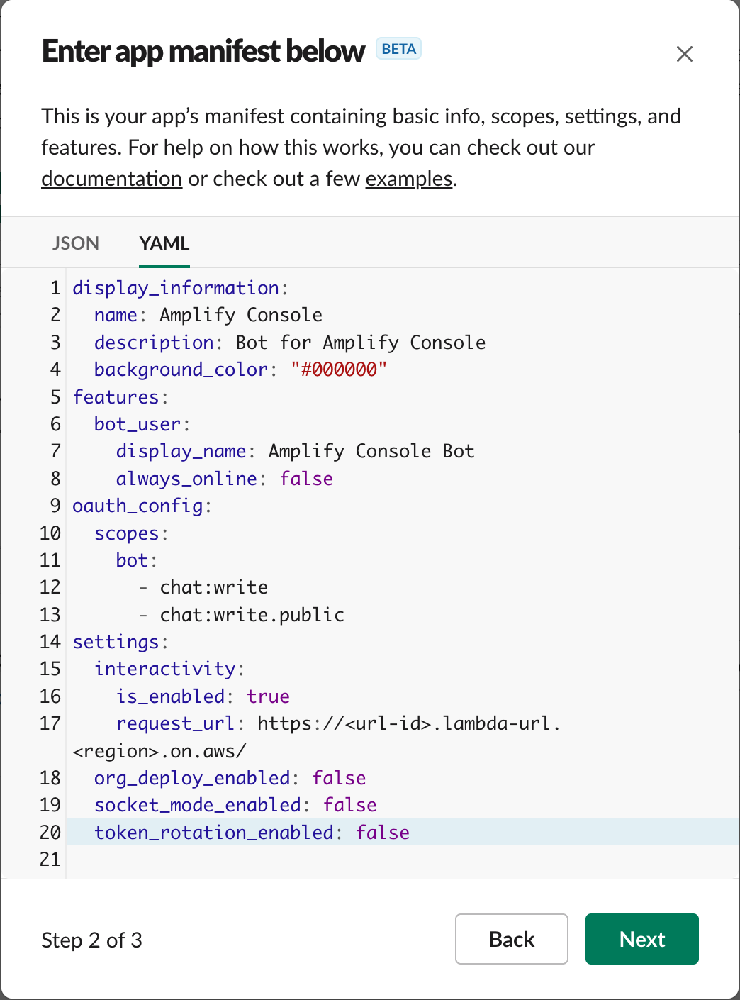
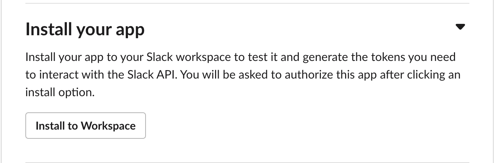

## Setup

### Create a Slack App

Visit [your apps](https://api.slack.com/apps) on the Slack API website, and click Create New App. Click `From an app manifest` on Dialog.


Then select which Slack workspace in which to install this app, and click `Next`.


Paste following YAML file contents as this app's manifest, and click `Next`.



This app's manifest:
```yml
display_information:
  name: Amplify Console
  description: Bot for Amplify Console
  background_color: "#000000"
features:
  bot_user:
    display_name: Amplify Console Bot
    always_online: false
oauth_config:
  scopes:
    bot:
      - chat:write
      - chat:write.public
settings:
  interactivity:
    is_enabled: true
    request_url: https://xxxxxxxx.execute-api.ap-northeast-1.amazonaws.com/bot/slack
  org_deploy_enabled: false
  socket_mode_enabled: false
  token_rotation_enabled: false
```

**`request_url` is a tentative value. Rewrite this value after deploying API Gateway**

Click `Create`.


### Install and Receive Token

Finally for the Slack settings, install your application into the Slack workspace and retrieve your OAuth Access Key.




